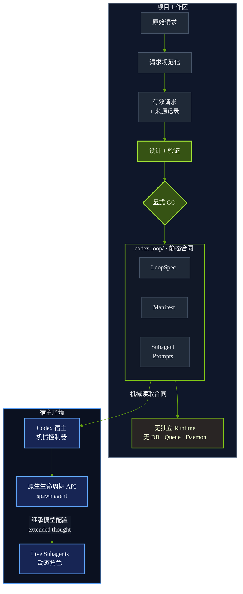
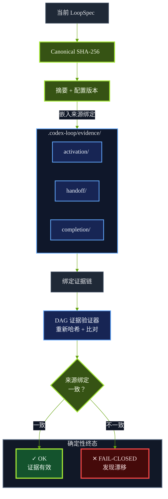
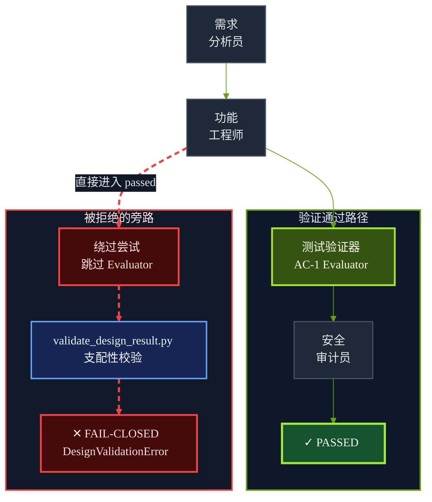

# Loopower Library

面向 Codex-native agent workflow 的可移植、合同优先 Skill 资产库。

**让所有宿主能力兼容的 GPT 模型使用受治理的 Sub-agent Loop。** Loopower 不再等待模型自发决定是否委派，而是将 sub-agent 激活、handoff、循环预算和退出条件转化为经过验证的项目本地合同。

当前首个发布 Skill 是 [`prompt-to-loop-engineering`](skills/prompt-to-loop-engineering/SKILL.md)，版本 `3.1.0`：它是使用 topology-derived professional roles、具备可验证请求规范化、主输出保证、配置绑定证据、原子 Replan 审批、Evidence-Locked DAG Execution Governance 和基于访问模式审阅隔离的 Codex-native Loop Agent Builder。它可以把自然语言任务转换为经过验证的 `loop_design_result`，在需要时持久化轻量 `.codex-loop/` Agent Config Scaffold，并在不独占会话路由的前提下治理审批、宿主原生 live sub-agent 激活与后验轨迹验证。

本项目不包含独立 Runtime Engine。Codex 就是宿主执行器：它读取项目本地配置，遵守 guardrails，在宿主支持时通过当前 Codex 宿主的原生能力激活已批准的 live sub-agents，与其他 specialized skills 协作，并在当前用户/会话权限下继续工作。

[English README](README.md)

## 架构总览



> 本图是经过简化的架构视图；JSON Schema 与验证器仍是规范事实来源。

## 它让 Codex 获得什么能力

`prompt-to-loop-engineering` 帮 Codex 设计并持久化：

- `LoopSpec`：循环规则、优先级、预算、进度信号和退出路径；
- `agent_manifest.json`：绑定 Codex、工具、知识源、sub-agent prompts 和续跑规则；
- `guardrails.json`：禁止命令、写入边界、需要审批的动作和停止条件；
- 从已验证拓扑推导出的精简 sub-agent prompts，例如 `requirements-analyst.md` 或 `security-auditor.md`；
- 可选 `.status` 文件，只记录当前 stage/node id；
- 用于对齐 `.codex-loop/subagents/*.md` 与 Codex 宿主 Live Subagents Panel 的激活合同；
- non-exclusive 治理覆盖层，让 specialized skills 继续作为 host-resolved atomic capabilities 被使用；
- `required_subagent_reasoning_intensity` 标记，用于记录复杂 live sub-agent 工作所需的 `extended_thought` 推理强度；
- Evidence-Locked DAG Execution Governance，用于阻止已声明的 sub-agent 节点被主会话 inline execution 替代。

它刻意保持轻量。`.codex-loop/` 是配置脚手架，不是数据库、队列、checkpoint 存储，也不是隐藏 runtime。

## 仓库结构

```text
meta-skills-library/
|-- README.md
|-- README-CN.md
|-- LICENSE
|-- .github/workflows/ci.yml
|-- examples/
|   `-- agents-gate/AGENTS.md
|-- install_local.py
|-- install_local.ps1
`-- skills/
    `-- prompt-to-loop-engineering/
        |-- SKILL.md
        |-- loop_spec.json
        |-- agents/openai.yaml
        |-- schemas/
        |-- examples/
        |-- templates/
        |   `-- agents-gate/AGENTS.md
        `-- scripts/
```

## Clone 和本地安装

克隆仓库：

```bash
git clone https://github.com/Beichen-H/meta-skills.git
cd meta-skills
```

安装到本地 Codex skills 目录，并验证内置 LoopSpec：

```bash
python install_local.py --verify
```

Windows PowerShell：

```powershell
powershell -NoProfile -ExecutionPolicy Bypass -File .\install_local.ps1 -Verify
```

默认安装位置：

```text
~/.codex/skills/prompt-to-loop-engineering/
```

只预览，不写入：

```bash
python install_local.py --dry-run
```

覆盖已有安装：

```bash
python install_local.py --force --verify
```

## installed-mode 兼容性

Codex 的 GitHub skill installer 可能只安装 `skills/prompt-to-loop-engineering/`，而不会复制完整仓库根目录。因此，本项目把运行所需模板也打包进 skill 目录内部。

安装后，委派门禁模板位于：

```text
~/.codex/skills/prompt-to-loop-engineering/templates/agents-gate/AGENTS.md
```

复制到目标项目：

```bash
cp ~/.codex/skills/prompt-to-loop-engineering/templates/agents-gate/AGENTS.md /path/to/your-project/AGENTS.md
```

Windows PowerShell：

```powershell
Copy-Item "$env:USERPROFILE\.codex\skills\prompt-to-loop-engineering\templates\agents-gate\AGENTS.md" C:\path\to\your-project\AGENTS.md
```

仓库根目录的 [`examples/agents-gate/AGENTS.md`](examples/agents-gate/AGENTS.md) 会与打包副本 [`skills/prompt-to-loop-engineering/templates/agents-gate/AGENTS.md`](skills/prompt-to-loop-engineering/templates/agents-gate/AGENTS.md) 保持逐字一致。

## 可选 AGENTS.md 全局委派门禁

如果你希望 Codex 在非平凡任务开始前主动判断是否需要 Loop Agent scaffold 和 sub-agent delegation，可以把可选门禁复制到目标项目根目录：

```bash
cp skills/prompt-to-loop-engineering/templates/agents-gate/AGENTS.md /path/to/your-project/AGENTS.md
```

该模板定义了 `Two-stage Delegation Approval Gate`：

1. 对 Non-trivial 任务，Codex 必须先给出 `Lineup Recommendation`、`Loop Boundary`、风险和 scaffold 决策。
2. Codex 必须输出 `STOP — Waiting for user approval`。
3. 只有得到用户显式授权后，Codex 才能初始化或更新 `.codex-loop/`、生成 sub-agent prompts，并运行 `validate_codex_loop_scaffold.py`。

这个门禁只负责审批流程和结构化提醒，不安装 Runtime Engine，不授予额外工具权限，也不允许 Codex 绕过用户批准。

## Live Subagent Bridge

版本 `1.4.0` 增加了 `Agent Lifecycle Activation Contract`。

### 让不同模型预设显式启用 Sub-agent 委派

在本项目的本地实测中，`5.6 Sol Ultra` 是受测预设里唯一能够在没有显式委派合同的情况下稳定主动启动 sub-agents 的预设。这与 [Codex 当前官方文档](https://developers.openai.com/codex/agent-configuration/subagents)一致：Ultra 可以主动委派，而其他 intelligence levels 可以在收到直接请求或适用的项目/Skill 指令后启动 sub-agents。这是路由方式的区别，并不代表其他模型在能力上天然无法使用 sub-agents。Loopower 不再依赖模型“自发想起委派”：它会探测宿主生命周期能力，根据 LoopSpec 拓扑推导任务专用阵容，持久化每个角色的 prompt，并在审批通过后要求显式激活 live processes。

因此，只要当前 Codex 宿主确实暴露并授权了 `spawn_agent`、`spawn_subagent` 或等效生命周期 API，标准模型和正常推理强度预设也可以进入受治理的 sub-agent loops。本 Skill 不会凭空创建宿主 API、改变模型权益、绕过权限，也不保证不同模型具有完全相同的委派质量。若宿主缺少生命周期能力，验证将 fail closed，而不会把主线程中的角色扮演伪装成 live sub-agent process。

阵容由拓扑决定，而不是固定模板：一个任务可以激活 researcher、data engineer、implementation specialist、security auditor、independent verifier，或其他有明确必要性的专业角色。有限 agent 集合、handoff、循环预算、进展信号、审阅隔离和终止路径均由 LoopSpec 定义。

当用户显式给出 `GO`，并且 `.codex-loop/` 已经写入且验证通过后，Codex 不能只把 scaffold 当作纯文本。如果当前 Codex 宿主暴露 `spawn_subagent`、`spawn_agent` 或等效原生 sub-agent lifecycle API，Codex 必须把 `.codex-loop/subagents/` 下已批准的角色激活为 live host processes。

每个 live role 必须使用对应本地 prompt 文件作为权威 System Prompt 基线。例如：

```text
.codex-loop/subagents/requirements-analyst.md -> requirements-analysis node
.codex-loop/subagents/feature-engineer.md     -> implementation node
.codex-loop/subagents/test-verifier.md        -> test-verification node
.codex-loop/subagents/security-auditor.md     -> security-review node
```

这些只是示例专业身份（not reserved roles），实际有限阵容由经过验证的 `delegation.agent_registry` 决定。

如果当前 Codex 宿主没有原生 live sub-agent API，Codex 必须报告 `lifecycle_activation_blocked`。它不得通过创建队列、数据库、daemon 或隐藏 Runtime Engine artifact 来伪造 live sub-agent。

## Model Configuration Inheritance Contract

版本 `1.6.0` 增加 `Model Configuration Inheritance Contract`。

当 Codex 通过 `spawn_subagent`、`spawn_agent`、`multi_agent_v1.spawn_agent` 或等效原生 API 激活 live sub-agents 时，如果宿主暴露 model 或 reasoning 配置参数，就必须显式请求继承父会话的推理配置。

推荐宿主声明：

```text
reasoning_intensity: "extended_thought"
model_config: inherit_parent
```

如果当前宿主 API 无法直接传递模型配置参数，生成的 sub-agent prompts 必须包含兜底指令，要求子线程在开始实质性工作前请求对齐父会话已批准的推理配置。若无法确认对齐，子线程必须报告 `model_configuration_degraded`。

任何依赖 live sub-agents 的 `agent_loop` scaffold，都必须在 `loop_spec.json` 中记录该要求：

```json
{
  "runtime_binding": {
    "capabilities_snapshot": {
      "required_subagent_reasoning_intensity": "extended_thought"
    }
  }
}
```

当设计需要 sub-agents 时，同样的值也必须出现在 `runtime_binding.required_capabilities.required_subagent_reasoning_intensity`。验证器可以拒绝缺失或弱化的值。

## Cooperative Governance Overlay

版本 `1.5.0` 明确本 skill 是 non-exclusive 的治理层。它不替代系统级 skills、superpowers-style skills、browser tools、research tools、code-generation skills、debugging skills 或 document/data skills。

当 `$prompt-to-loop-engineering` 被显式调用，或 `AGENTS.md` 加载本合同后，它会在非平凡 scaffold 创建或生命周期激活前治理五个变量：

- `task_classification`
- `capability_snapshot`
- `lineup_recommendation`
- `loop_boundary`
- `approval_state`

Specialized skills 仍然是各自领域的主要能力提供者。loop scaffold 只能把它们引用为 host-resolved atomic capabilities：Codex 可以通过正常宿主路由或明确暴露的 tool API 使用它们，但本 skill 不得假装它们是私有函数、后台 worker 或异步工具。

这是一种 AGENTS-scoped middleware semantics，不是 transparent global interceptor。如果本合同没有通过显式调用或更高优先级指令层加载，它不能静默拦截每一次 Codex action。

## Evidence-Locked DAG Execution Governance

版本 `1.7.0` 增加 `Evidence-Locked DAG Execution Governance`。

在用户显式给出 `GO` 之后，持久化的 `.codex-loop/loop_spec.json` 拥有 DAG 调度权。Codex 仍然可以在授权节点内部使用 specialized host skills 作为 host-resolved atomic capabilities，但这些能力不得接管 scheduler，也不得把脚手架坍缩为 inline execution。

生成的 scaffold 必须声明：

```text
loop_spec.execution_governance.runtime_mode = COOPERATIVE_GOVERNANCE
loop_spec.execution_governance.scheduler = codex_loop_dag
loop_spec.execution_governance.inline_execution_policy = forbidden_for_subagent_nodes
agent_manifest.governance_overlay.host_linear_fulfillment_takeover = forbidden
```

依赖 sub-agent 节点的 GO 阶段工作必须在以下目录创建轻量证据：

```text
.codex-loop/evidence/activation/
.codex-loop/evidence/handoff/
.codex-loop/evidence/completion/
```

使用 post-hoc hard validator 拒绝缺少 activation、handoff、completion、model-inheritance 或 inline-fulfillment 证据的运行轨迹：

```bash
python ~/.codex/skills/prompt-to-loop-engineering/scripts/validate_dag_execution_evidence.py .codex-loop
```

### 证据哈希链



> 本图是简化后的证据流；Schema `3.0.0` 与 `validate_dag_execution_evidence.py` 仍是权威合同。

## 动态专业角色拓扑

版本 `3.0.0` 使用 topology-derived professional roles 替代固定三角色阵容。生成的 LoopSpec 可以声明 `requirements-analyst`、`feature-engineer`、`test-verifier`、`security-auditor` 或其他任务专用身份。这些名称只是示例、not reserved roles；权限来自闭合的 `governance_role` 分类与已验证的工具绑定，而不是专业 id。

本合同设定 no universal declared-role ceiling，但每个生成的 registry 与 Manifest 都必须是 finite, statically validated，并在已批准的 GO 阶段保持闭合。声明的团队规模不代表同时执行；capability-bound concurrency 受规范化后的宿主生命周期能力与并行能力限制。如果需要新增专家，宿主必须暂停、修订 scaffold、重新验证，并在激活前取得任何必要的新批准。

权责边界是确定的：LoopSpec owns transition and termination policy。Codex host controller mechanically evaluates 已声明的谓词与硬停止条件，并且只能选择满足条件的已声明边。reviewers and verifiers produce evidence only；它们不能选边、修改阈值、写入控制器状态或宣布全局完成。

### 评估器路径支配性



> 本图压缩了示例拓扑；mandatory evaluator 绑定与静态支配性验证器定义实际验收规则。

一个代表性的动态 prompt 树如下：

```text
.codex-loop/subagents/
|-- requirements-analyst.md
|-- feature-engineer.md
|-- test-verifier.md
`-- security-auditor.md
```

## 架构效能与边界评估

这层治理不是通用性能加速器。对于输入固定、动作唯一且具有确定性校验的低熵简单任务，Codex 直接执行与经过验证的 `one_shot` 通常不会产生实质结果差异。启用完整设计链会为请求规范化、能力快照、Schema 校验和来源记录带来轻量的 Token 与延迟开销。因此应始终选择足够完成任务的最简单 disposition，不能因为具备循环能力就强行构造 agent loop。

v3.1.0 不宣称可以普遍降低某个固定百分比的 Token、延迟或失败率。实际盈亏平衡点取决于任务熵、循环长度、工具成本、声明的 agent 数量，以及宿主执行持久化门禁的频率。每增加一个专业 prompt 与生命周期证据流，都会增加可测量的 prompt、验证与追踪存储开销。

当任务具有长周期、自适应、权限敏感或多角色协作特征时，这套架构的价值才会显现。v3.1.0 将原本可能开放式扩散的“不确定性灾难”转换为确定性的拒绝或熔断条件：预算显式化、停滞进展可测量、写入权与验收权相互隔离、主输出显式化，并把请求、配置和运行证据通过哈希绑定。它不保证用户任务必然成功；它限制失败扩散，并让停止原因可以被检查和复现。

| 维度 | 裸奔（无治理）宿主执行 | v3.1.0 治理模式 |
|---|---|---|
| Token 行为 | 简单任务的启动成本最低，但缺少合同级上限，无法阻止重复规划或停滞循环持续消耗 Token。 | 增加前置规范化、每个 agent prompt 与证据验证开销；agent loop 显式声明最大运行时长、迭代次数、Token 预算和无进展轮数。严格 Token 熔断仍依赖宿主 API 或控制器持有的权威计数器。 |
| 熔断能力 | 依赖模型或用户自行察觉停滞，退出行为可能只存在于自然语言上下文中。 | 确定性进展事实与四项刚性上限会让越界或连续无进展证据触发 validator 失败；除非 Codex 宿主在每个规定门禁运行 validator 并在失败时停止，否则该约束仍属于后验裁判。 |
| 权限隔离 | 工具权限与角色边界可能隐含在会话上下文中。 | 能力快照把每个可用工具分类为 `read_only`、`workspace_write` 或 `external_write`；reviewer/verifier 只能绑定只读工具。这是合同级隔离，不是操作系统沙箱，也不会赋予任何新权限。 |
| 哈希追溯 | Prompt 的重新解释与默认值注入在事后可能难以还原。 | Canonical SHA-256 哈希把保留的原始请求、独立的有效请求与版本化规范化报告绑定起来。哈希可以发现资产漂移，但不能证明外部证据或宿主上报的测量值一定真实。 |

Normalizer 不修改原始请求，而是生成独立的有效请求与 Provenance 报告。符合 v2.0.0 合同的通用报告结构如下：

```json
{
  "schema_version": "2.0.0",
  "normalizer_version": "2.0.0",
  "default_policy_id": "codex-native-safe-v1",
  "raw_request_hash": "sha256:0123456789abcdef0123456789abcdef0123456789abcdef0123456789abcdef",
  "effective_request_hash": "sha256:abcdef0123456789abcdef0123456789abcdef0123456789abcdef0123456789",
  "defaults_applied": {
    "max_iterations": 3,
    "max_token_budget": 45000,
    "max_no_progress_loops": 1
  },
  "explicit_budget_fields": [
    "max_runtime_seconds"
  ],
  "source_preserved": true
}
```

`defaults_applied` 只包含原始请求中缺失的字段；`explicit_budget_fields` 记录调用者显式提供且通过校验的值。Validator 会重新计算两个哈希，并拒绝 raw/effective/report 三者不一致的输入。因此，该报告在保持用户原始输入不可变的同时，建立了可验证的转换来源链。

## 在 Codex 项目中使用

安装后，在任意 Codex 项目中输入：

```text
$prompt-to-loop-engineering

请分析当前项目需求，并创建一个轻量 .codex-loop/ Agent Config Scaffold：
- .codex-loop/loop_spec.json
- .codex-loop/agent_manifest.json
- .codex-loop/guardrails.json
- 每个 registry entry 对应一个 .codex-loop/subagents/<agent-id>.md
- 可选 .codex-loop/.status
- 可选 .codex-loop/evidence/ lifecycle stubs，在 GO 阶段工作开始后记录证据

然后用本地脚本验证这个 scaffold。
```

Codex 应读取该 Skill，为当前项目生成 scaffold，并运行：

```bash
python ~/.codex/skills/prompt-to-loop-engineering/scripts/validate_codex_loop_scaffold.py .codex-loop
```

如果你正在本仓库内开发，使用：

```bash
python skills/prompt-to-loop-engineering/scripts/validate_codex_loop_scaffold.py \
  skills/prompt-to-loop-engineering/examples/codex-loop
```

## Scaffold 合同

有效 scaffold 的最小结构：

```text
.codex-loop/
|-- loop_spec.json
|-- agent_manifest.json
|-- guardrails.json
|-- subagents/
|   |-- requirements-analyst.md
|   |-- feature-engineer.md
|   |-- test-verifier.md
|   `-- security-auditor.md
|-- evidence/
|   |-- activation/
|   |-- handoff/
|   `-- completion/
`-- .status
```

验证器会拒绝：

- 缺少必要文件；
- 目录名不是 `.codex-loop`；
- `runtime/`、`state.json`、队列、数据库、checkpoint 存储等 runtime 产物；
- 多行或非法 `.status`；
- manifest 声明的 sub-agent prompt 文件不存在；
- manifest 声称存在独立 Runtime Engine；
- evidence-governed DAG runs 缺少 `activation`、`handoff` 或 `completion` 证据；
- sub-agent-governed nodes 出现 inline execution evidence。

## 本地验证

运行全部测试：

```bash
python -B -m unittest discover -s skills/prompt-to-loop-engineering/scripts -p "test_*.py" -v
```

验证内置 scaffold 示例：

```bash
python -B skills/prompt-to-loop-engineering/scripts/validate_codex_loop_scaffold.py \
  skills/prompt-to-loop-engineering/examples/codex-loop
```

验证 post-hoc DAG execution evidence：

```bash
python -B skills/prompt-to-loop-engineering/scripts/validate_dag_execution_evidence.py \
  skills/prompt-to-loop-engineering/examples/codex-loop
```

验证 Skill 自身静态 DAG：

```bash
python -B skills/prompt-to-loop-engineering/scripts/test_spec_loading.py
```

验证已发布的 design-result 示例：

在设计验证前，先规范化缺少预算字段的原始请求：

```bash
python skills/prompt-to-loop-engineering/scripts/normalize_design_request.py \
  path/to/raw_request.json \
  --output path/to/effective_request.json \
  --report path/to/request_normalization_report.json
```

该命令不会修改源文件。缺失上限使用版本化 `codex-native-safe-v1` 策略；显式无效值会失败，不会被悄悄替换。随后使用 effective request 执行下面的验证命令。

```bash
python -B skills/prompt-to-loop-engineering/scripts/validate_design_result.py \
  path/to/loop_design_result.json \
  --request path/to/effective_request.json \
  --raw-request path/to/raw_request.json \
  --normalization-report path/to/request_normalization_report.json
```

## License

本仓库采用 [MIT License](LICENSE) 发布。

## Release notes

### v3.1.0 (2026-07-15)

- 新增强制 LoopSpec `output_binding`；进入 `passed` 前，声明的非控制器主输出必须非空。
- 新增成功路径支配检查：每个 mandatory evaluator 必须位于所有通往 `passed` 终态的路径上。
- 将 Agent Manifest 与 lifecycle/progress evidence 合同升级为 `3.0.0`，用 `config_version` 和规范化 `loop_spec_digest` 绑定每条运行证据。
- 新增 GO capability-preflight 证据，在 live activation 前对能力漂移执行 fail-closed 检查。
- 新增 `replan_proposal.schema.json` 和 `validate_replan_proposal.py`，拒绝过期基础版本、未精确批准的预览以及审批后的配置替换。
- 保持零独立 Runtime：新增内容全部是静态合同与后验验证器。

现有 v3.0 scaffold 必须整体重新生成或整体迁移。不要把 v3.0 lifecycle evidence 与 v3.1 Manifest 混用；digest 与 config-version 校验会主动拒绝跨代混合。

### v3.0.0 (2026-07-13)

- 用有限、由拓扑推导的 `delegation.agent_registry` 替代固定三角色上限；专业 id 是开放的安全 slug，治理角色仍是闭合的权限分类。
- 将破坏性变更后的 Agent Manifest schema 升级为 `2.0.0`，并通过 `agent_ref` 强制 registry/Manifest 生命周期字段完全对齐。
- 为强制验收标准新增机器可检验的 `subject_nodes` 和独立 `evaluator_node` 身份。
- 明确 LoopSpec 是转换、硬停止与终止含义的策略权威；Codex 宿主是受策略约束的评估/执行者，reviewer 只产生证据。
- 将 prompt 文件与生命周期证据验证推广到任意有限角色阵容，同时让实际并发继续受宿主能力限制。

#### v2-to-v3 migration

v3 Skill/package 使用 Manifest schema `2.0.0`。必须 regenerate v2 scaffolds，不能从旧的 `planner`、`executor` 或 `reviewer` 名称静默推断权限。重新生成后，LoopSpec 必须提供 `delegation.agent_registry`，每个受治理节点必须提供 `agent_ref`，强制标准必须声明相互独立的 `subject_nodes` 与 `evaluator_node`，并由 `termination_control` 记录受策略约束的终止合同。只有 v3 scaffold、DAG evidence 和 progress validator 全部通过后才能激活迁移后的 scaffold。

### v2.0.0 (2026-07-10)

- 将 raw/effective request 哈希与规范化来源报告升级为 Validator 强制输入。
- 统一能力 Schema 与 Validator，包括 `required_subagent_reasoning_intensity`。
- 分离设计期 LoopSpec 与 GO 阶段 scaffold 的治理字段要求。
- 使用声明式 `access_mode` 替代 reviewer 工具名黑名单。
- 新增 `progress_evidence.schema.json` v2，覆盖 run/cycle 身份、连续序列、权威计数器与多 Cycle 隔离。
- 增加发布表面回归测试与更严格的 CI 门禁。

### v1.9.0 (2026-07-10)

- 新增 `scripts/normalize_design_request.py`，在不修改用户原始输入的前提下生成严格的 effective request。
- 新增版本化 `codex-native-safe-v1` 预算策略：900 秒、3 次迭代、45,000 Token、1 次无进展循环。
- 新增确定性规范化来源报告，记录 raw/effective 哈希以及显式值和默认值。
- 保持 `validate_design_result.py` fail-closed，禁止验证器隐式修复输入。
- 扩展 `validate_loop_progress_evidence.py`，根据持久化 LoopSpec 阈值执行运行时长、迭代、Token 和无进展四项熔断。

### v1.8.0 (2026-07-09)

- 增加 `Evidence-Locked & Role-Isolated Governance`。
- 强制四个循环硬上限：`max_runtime_seconds`、`max_iterations`、`max_token_budget` 和 `max_no_progress_loops`。
- 增加 node role metadata 与 implementer/reviewer isolation validation。
- 增加 deterministic no-progress progress-signal 要求。
- 增加 `scripts/validate_loop_progress_evidence.py`，用于 post-hoc stalled-loop detection。

### v1.7.0 (2026-07-07)

- 增加 `Evidence-Locked DAG Execution Governance`。
- 在 `loop_spec.json` 增加 `execution_governance`，在 `agent_manifest.json` 增加 `governance_overlay`。
- 增加 `.codex-loop/evidence/{activation,handoff,completion}/` 示例桩。
- 增加 `scripts/validate_dag_execution_evidence.py`，用于 post-hoc hard validation。
- 明确禁止显式 GO 后由线性 host skill 接管 scheduler；specialized skills 只能作为 node-scoped atomic capabilities 使用。
- 增加缺少 activation、handoff、completion、reasoning-inheritance 与 inline execution 证据时的失败测试。

### v1.6.0 (2026-07-06)

- 增加 `Model Configuration Inheritance Contract`。
- 要求宿主原生 sub-agent 激活在可用时显式请求 `reasoning_intensity: "extended_thought"` 或 `model_config: inherit_parent`。
- 为无法直接传递模型配置参数的宿主增加 sub-agent prompt 兜底要求。
- 在 scaffold capability snapshot 与 required capabilities 中增加 `required_subagent_reasoning_intensity: "extended_thought"`。
- 加强 scaffold 验证：依赖 sub-agent 的 scaffold 若缺少推理强度标记，将被拒绝。

### v1.5.0 (2026-07-05)

- 增加 `Cooperative Governance Overlay` 合同。
- 明确本 skill 是 non-exclusive，不能声称拥有整个会话的独占路由权。
- 定义 AGENTS-scoped middleware semantics，同时禁止 background daemon、global hook、scheduler 或 hidden runtime 行为。
- 将外部 skills、plugins、connectors 和 tools 重构为 host-resolved atomic capabilities，而不是可直接调用的私有函数。
- 增加五个治理变量：`task_classification`、`capability_snapshot`、`lineup_recommendation`、`loop_boundary` 和 `approval_state`。
- 保留 specialized host skills 作为主要能力提供者，同时由本 skill 治理 loop design、approval、scaffold persistence 和 lifecycle boundaries。

### v1.4.0 (2026-07-02)

- 通过 `Agent Lifecycle Activation Contract` 增加 Codex-native Live Subagent Bridge。
- 将 `Two-stage Delegation Approval Gate` 打包进已安装 skill 内部：`templates/agents-gate/AGENTS.md`。
- 保留仓库根目录副本 `examples/agents-gate/AGENTS.md`，并增加测试防止两份模板漂移。
- 增加 installed-mode 兼容性检查，使 path-only Codex 安装后的 skill 也能被验证。
- 增加 GitHub Actions CI，覆盖单元测试、scaffold 验证、DAG 验证和已发布示例验证。

### v1.3.0 (2026-06-30)

- 将 `prompt-to-loop-engineering` 定位为 Codex-native Loop Agent Builder。
- 永久移除独立 Runtime Engine 职责。
- 增加轻量 `.codex-loop/` Agent Config Scaffold 合同。
- 增加 `schemas/agent_manifest.schema.json` 和 `schemas/guardrails.schema.json`。
- 增加 `scripts/validate_codex_loop_scaffold.py`。
- 增加完整 scaffold 示例 `examples/codex-loop/`。
- 增加本地一键安装与验证脚本。
- 增加可选 `Two-stage Delegation Approval Gate` 模板：`examples/agents-gate/AGENTS.md`。
- 以 MIT License 发布仓库。

### v1.0.0 (2026-06-22)

- 初始化多 Skill 资产库。
- 发布首个 Skill：`prompt-to-loop-engineering`。
- 固化 Loop Engineering KB v4.0.2 的 request/result 边界和 build/runtime-result 分离原则。
