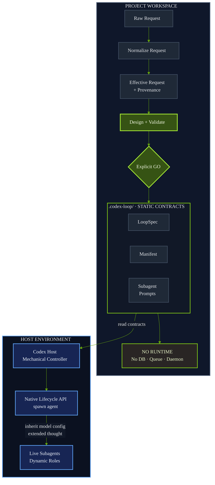
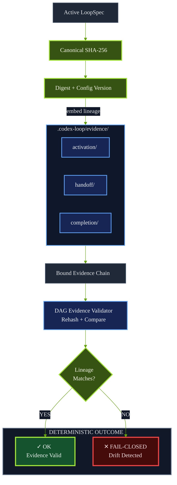
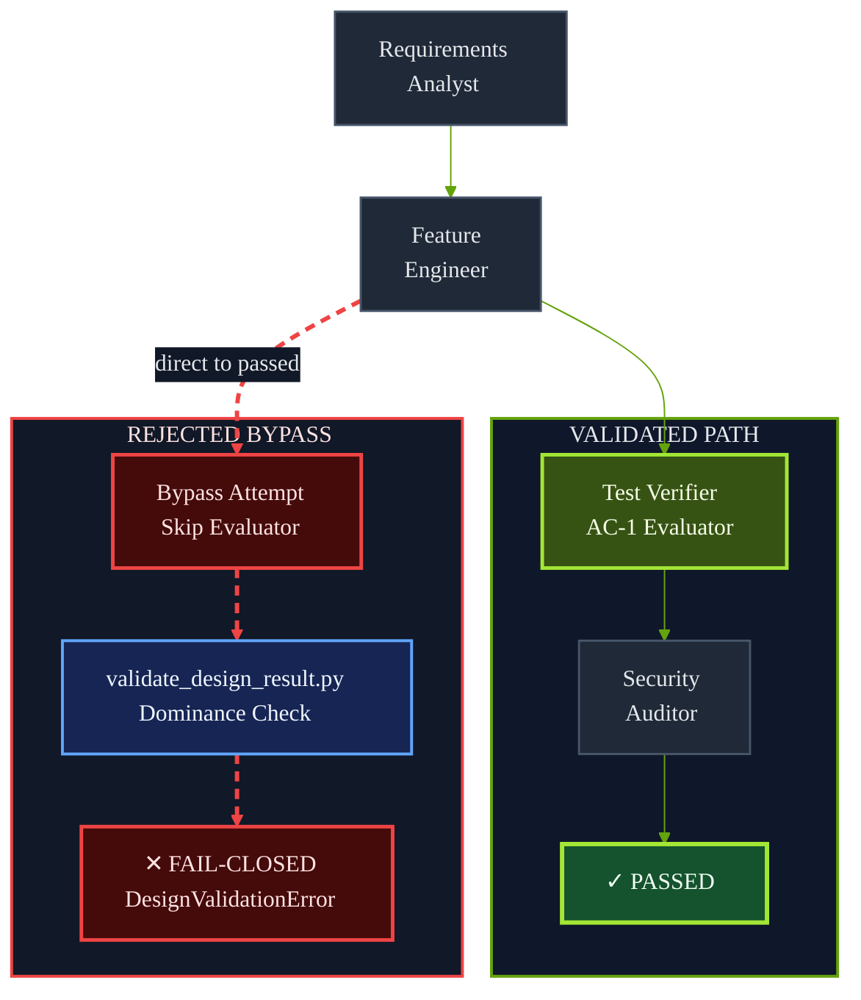

# Loopower Library

Portable, contract-first skills for Codex-native agent workflows.

**Governed sub-agent loops for every host-capable GPT model.** Instead of waiting for a model to delegate spontaneously, Loopower turns sub-agent activation, handoffs, loop budgets, and exit conditions into validated project-local contracts.

The first published skill is [`prompt-to-loop-engineering`](skills/prompt-to-loop-engineering/SKILL.md), version `3.1.0`: a Codex-native Loop Agent Builder with topology-derived professional roles, verified request normalization, primary-output guarantees, configuration-bound evidence, atomic replan approval, Evidence-Locked DAG Execution Governance, and access-mode-based reviewer isolation. It turns a natural-language task into a validated `loop_design_result`, persists a lightweight `.codex-loop/` Agent Config Scaffold when requested, and governs approval, host-native live sub-agent activation, and post-hoc evidence validation without taking exclusive control of the session.

This project does not contain an independent Runtime Engine. Codex is the host executor: it reads project-local configuration, respects guardrails, activates approved live sub-agents through the current Codex host when available, cooperates with other specialized skills, and continues work under the active user/session permissions.

[中文说明](README-CN.md)

## Architecture at a glance



> This diagram is a simplified architectural view. JSON Schemas and validators remain the normative source of truth.

## What it gives Codex

`prompt-to-loop-engineering` helps Codex design and persist:

- a `LoopSpec` with loop rules, priorities, budgets, progress signals, and exit paths;
- an `agent_manifest.json` binding Codex to tools, knowledge sources, sub-agent prompts, and resume rules;
- a `guardrails.json` file for forbidden commands, write boundaries, approval-required actions, and stop conditions;
- compact sub-agent prompts derived from the validated topology, such as `requirements-analyst.md` or `security-auditor.md`;
- an optional `.status` file that stores only the current stage/node id;
- an activation contract for aligning `.codex-loop/subagents/*.md` with the Codex host's Live Subagents Panel;
- a non-exclusive governance overlay that keeps specialized skills available as host-resolved atomic capabilities;
- a `required_subagent_reasoning_intensity` marker that records `extended_thought` requirements for complex live sub-agent work;
- an Evidence-Locked DAG Execution Governance contract that blocks validated sub-agent nodes from being replaced by inline execution.
- a primary-output binding that prevents `passed` without the declared user-facing deliverable;
- immutable config-version and LoopSpec-digest bindings across preflight, activation, handoff, completion, and progress evidence;
- preview-exact replan validation that rejects stale bases or substituted post-approval designs.

It is intentionally small. `.codex-loop/` is configuration, not a database, queue, checkpoint store, or hidden runtime.

## Repository layout

```text
meta-skills-library/
|-- README.md
|-- README-CN.md
|-- LICENSE
|-- .github/workflows/ci.yml
|-- examples/
|   `-- agents-gate/AGENTS.md
|-- install_local.py
|-- install_local.ps1
`-- skills/
    `-- prompt-to-loop-engineering/
        |-- SKILL.md
        |-- loop_spec.json
        |-- agents/openai.yaml
        |-- schemas/
        |-- examples/
        |-- templates/
        |   `-- agents-gate/AGENTS.md
        `-- scripts/
```

## Local Installation

Clone the repository:

```bash
git clone https://github.com/Beichen-H/meta-skills.git
cd meta-skills
```

Install the skill into the local Codex skills directory and verify the bundled LoopSpec:

```bash
python install_local.py --verify
```

On Windows PowerShell:

```powershell
powershell -NoProfile -ExecutionPolicy Bypass -File .\install_local.ps1 -Verify
```

Default install location:

```text
~/.codex/skills/prompt-to-loop-engineering/
```

Preview without writing files:

```bash
python install_local.py --dry-run
```

Replace an existing local install:

```bash
python install_local.py --force --verify
```

## Installed-mode compatibility

Codex's GitHub skill installer may install only `skills/prompt-to-loop-engineering/` rather than the full repository root. The skill therefore packages operational templates inside the skill directory itself.

After installation, the delegation gate is available at:

```text
~/.codex/skills/prompt-to-loop-engineering/templates/agents-gate/AGENTS.md
```

Copy it into a target project with:

```bash
cp ~/.codex/skills/prompt-to-loop-engineering/templates/agents-gate/AGENTS.md /path/to/your-project/AGENTS.md
```

On Windows PowerShell:

```powershell
Copy-Item "$env:USERPROFILE\.codex\skills\prompt-to-loop-engineering\templates\agents-gate\AGENTS.md" C:\path\to\your-project\AGENTS.md
```

The repository-root copy at [`examples/agents-gate/AGENTS.md`](examples/agents-gate/AGENTS.md) is kept byte-for-byte aligned with the packaged copy at [`skills/prompt-to-loop-engineering/templates/agents-gate/AGENTS.md`](skills/prompt-to-loop-engineering/templates/agents-gate/AGENTS.md).

## Optional AGENTS.md delegation gate

For teams that want Codex to proactively consider Loop Agent scaffolding and sub-agent delegation, copy the optional gate into the target project root:

```bash
cp skills/prompt-to-loop-engineering/templates/agents-gate/AGENTS.md /path/to/your-project/AGENTS.md
```

The template defines a `Two-stage Delegation Approval Gate`:

1. For Non-trivial work, Codex first presents a `Lineup Recommendation`, `Loop Boundary`, risks, and scaffold decision.
2. Codex then prints `STOP — Waiting for user approval`.
3. Only after explicit user approval may Codex initialize or update `.codex-loop/`, generate sub-agent prompts, and run `validate_codex_loop_scaffold.py`.

This gate is advisory and permission-preserving. It does not install a Runtime Engine, does not grant tool permissions, and does not allow Codex to bypass user approval.

## Live Subagent Bridge

Version `1.4.0` adds the `Agent Lifecycle Activation Contract`.

### Making sub-agent delegation explicit across model presets

In project-local testing, the `5.6 Sol Ultra` preset was the only tested preset that consistently initiated sub-agents without an explicit delegation contract. This matches the [current Codex documentation](https://developers.openai.com/codex/agent-configuration/subagents): Ultra may delegate proactively, while other intelligence levels can spawn sub-agents after a direct request or applicable project/Skill instruction. This is a routing distinction, not evidence that other models are intrinsically unable to use sub-agents. Loopower removes reliance on spontaneous delegation: it discovers the host lifecycle capability, derives a task-specific sub-agent lineup from the LoopSpec topology, persists each role prompt, and requires explicit live-process activation after approval.

As a result, standard models and normal reasoning presets can participate in governed sub-agent loops when the active Codex host exposes an authorized `spawn_agent`, `spawn_subagent`, or equivalent lifecycle API. The Skill does not create a missing host API, change model entitlements, bypass permissions, or guarantee identical delegation quality across models. If lifecycle capability is absent, validation fails closed instead of pretending that inline role-play is a live sub-agent process.

The lineup is topology-derived rather than fixed: a task may activate a researcher, data engineer, implementation specialist, security auditor, independent verifier, or another justified professional role. The LoopSpec defines the finite agent set, handoffs, loop budgets, progress signals, reviewer isolation, and termination paths.

After a user gives explicit `GO`, and after `.codex-loop/` has been written and validated, Codex must not treat the scaffold as passive text only. If the current Codex host exposes `spawn_subagent`, `spawn_agent`, or an equivalent native sub-agent lifecycle API, Codex must activate approved roles from `.codex-loop/subagents/` as live host processes.

Each live role must use the corresponding local prompt file as its authoritative System Prompt baseline. For example:

```text
.codex-loop/subagents/requirements-analyst.md -> requirements-analysis node
.codex-loop/subagents/feature-engineer.md     -> implementation node
.codex-loop/subagents/test-verifier.md        -> test-verification node
.codex-loop/subagents/security-auditor.md     -> security-review node
```

These are illustrative professional ids, not reserved roles. The validated `delegation.agent_registry` determines the actual finite lineup for each task.

If the active Codex host does not expose a native live sub-agent API, Codex must report `lifecycle_activation_blocked`. It must not emulate live sub-agents by creating queues, databases, daemons, or hidden Runtime Engine artifacts.

## Model Configuration Inheritance Contract

Version `1.6.0` adds the `Model Configuration Inheritance Contract`.

When Codex activates live sub-agents through `spawn_subagent`, `spawn_agent`, `multi_agent_v1.spawn_agent`, or an equivalent native API, it must explicitly request parent-level reasoning inheritance whenever the host exposes a model or reasoning configuration parameter.

Preferred host declarations include:

```text
reasoning_intensity: "extended_thought"
model_config: inherit_parent
```

If the active host API cannot pass a model configuration parameter, generated sub-agent prompts must include a fallback instruction requiring the child thread to request alignment with the parent session's approved reasoning profile before substantive work. If alignment cannot be confirmed, the child must report `model_configuration_degraded`.

Every generated `agent_loop` scaffold that relies on live sub-agents must log the requirement in `loop_spec.json`:

```json
{
  "runtime_binding": {
    "capabilities_snapshot": {
      "required_subagent_reasoning_intensity": "extended_thought"
    }
  }
}
```

The same value must appear in `runtime_binding.required_capabilities.required_subagent_reasoning_intensity` when sub-agents are required for the design. Validators may reject weaker or missing values.

## Cooperative Governance Overlay

Version `1.5.0` makes the skill explicitly non-exclusive. It does not replace system-level skills, superpowers-style skills, browser tools, research tools, code-generation skills, debugging skills, or document/data skills.

Instead, when `$prompt-to-loop-engineering` is invoked or when an `AGENTS.md` file loads this contract, it governs five variables before non-trivial scaffold creation or lifecycle activation:

- `task_classification`
- `capability_snapshot`
- `lineup_recommendation`
- `loop_boundary`
- `approval_state`

Specialized skills remain primary providers for their own domains. The loop scaffold may reference them only as host-resolved atomic capabilities: Codex may use them through normal host routing or concrete exposed tool APIs, but this skill must not pretend they are private functions, background workers, or asynchronous tools.

This is AGENTS-scoped middleware semantics, not a transparent global interceptor. If the contract is not loaded by explicit invocation or a higher-priority instruction layer, it cannot silently intercept every Codex action.

## Evidence-Locked DAG Execution Governance

Version `1.7.0` adds the `Evidence-Locked DAG Execution Governance` contract.

After explicit `GO`, the persisted `.codex-loop/loop_spec.json` owns DAG scheduling. Codex may still use specialized host skills as host-resolved atomic capabilities inside an authorized node, but those skills must not take over scheduling or collapse the scaffold into inline execution.

Generated scaffolds now declare:

```text
loop_spec.execution_governance.runtime_mode = COOPERATIVE_GOVERNANCE
loop_spec.execution_governance.scheduler = codex_loop_dag
loop_spec.execution_governance.inline_execution_policy = forbidden_for_subagent_nodes
agent_manifest.governance_overlay.host_linear_fulfillment_takeover = forbidden
```

GO-phase work that uses sub-agent-governed nodes must create lightweight evidence under:

```text
.codex-loop/evidence/activation/
.codex-loop/evidence/handoff/
.codex-loop/evidence/completion/
```

Use the post-hoc hard validator to reject missing activation, handoff, completion, model-inheritance, or inline-fulfillment evidence:

```bash
python ~/.codex/skills/prompt-to-loop-engineering/scripts/validate_dag_execution_evidence.py .codex-loop
```

### Evidence hash chain



> This diagram is a simplified evidence flow. Schema `3.0.0` and `validate_dag_execution_evidence.py` remain authoritative.

## Dynamic Professional Topology

Version `3.0.0` replaces the fixed three-role cast with topology-derived professional roles. A generated LoopSpec may declare `requirements-analyst`, `feature-engineer`, `test-verifier`, `security-auditor`, or other task-specific identities. These names are examples and not reserved roles; authority comes from the closed `governance_role` classification and validated tool bindings, never from a professional id.

There is no universal declared-role ceiling. Every generated registry and Manifest is nevertheless finite, statically validated, and closed for the approved GO phase. Declared team size does not imply simultaneous execution: capability-bound concurrency is limited by the normalized host lifecycle and parallel-execution capabilities. A newly needed specialist requires the host to pause, amend the scaffold, revalidate it, and obtain any required fresh approval before activation.

The authority boundary is explicit: LoopSpec owns transition and termination policy. The Codex host controller mechanically evaluates declared predicates and hard stops, then selects only an eligible declared edge. Under this contract, reviewers and verifiers produce evidence only; they cannot select edges, change thresholds, write controller-owned state, or declare global completion.

### Evaluator path dominance



> This diagram compresses the example topology. Mandatory evaluator bindings and the static dominance validator define the actual acceptance rule.

A representative generated prompt tree is:

```text
.codex-loop/subagents/
|-- requirements-analyst.md
|-- feature-engineer.md
|-- test-verifier.md
`-- security-auditor.md
```

## Architectural Efficacy & Boundaries Evaluation

This governance layer is not a universal performance accelerator. For a low-entropy task with a fixed input, one obvious action, and a deterministic check, direct Codex execution and a validated `one_shot` usually produce the same practical result. Activating the full design path adds a small token and latency cost for request normalization, capability snapshotting, schema validation, and provenance recording. Use the simplest sufficient disposition; do not build an agent loop merely because the machinery is available.

v3.1.0 does not claim a universal percentage reduction in tokens, latency, or failures. The break-even point depends on task entropy, loop length, tool cost, declared agent count, and how often the host evaluates the persisted gates. Each additional professional prompt and lifecycle evidence stream adds measurable prompt, validation, and trace-storage overhead.

The value changes when work is long-running, adaptive, permission-sensitive, or distributed across roles. In those cases, v3.1.0 converts an otherwise open-ended uncertainty failure into a deterministic refusal or circuit-break condition: budgets are explicit, stalled progress is measurable, write authority is separated from review, the primary output is explicit, and request/config/run evidence is hash-addressed. This does not guarantee task success. It bounds failure and makes the reason for stopping inspectable.

| Dimension | Ungoverned (`bare`) host execution | v3.1.0 governed execution |
|---|---|---|
| Token behavior | Minimal setup cost for simple tasks, but no contract-level ceiling prevents repeated replanning or stalled-loop token growth. | Adds front-loaded normalization, per-agent prompt, and evidence-validation tokens; agent loops carry explicit runtime, iteration, token, and no-progress limits. Strict token enforcement still requires an authoritative host or controller-owned counter. |
| Circuit breaking | Depends on the model or user noticing that work is stalled. Exit behavior may remain implicit. | Deterministic progress facts and four hard limits cause validation to fail on limit breaches or repeated no-progress evidence. Enforcement is post-hoc unless the Codex host runs the validator at each required gate and stops on failure. |
| Permission isolation | Tool availability and role boundaries may remain implicit in conversation context. | The capability snapshot classifies each available tool as `read_only`, `workspace_write`, or `external_write`; reviewer/verifier nodes may bind only read-only tools. This is contractual isolation, not an operating-system sandbox or a grant of new permissions. |
| Hash traceability | Prompt reinterpretation and default injection may be difficult to reconstruct after the fact. | Canonical SHA-256 hashes bind the preserved raw request and separate effective request to a versioned normalization report. Hashes reveal artifact drift; they do not prove that external evidence or host-reported measurements are truthful. |

The normalizer emits a separate effective request and a provenance report without mutating the original request. A conforming report has this general shape:

```json
{
  "schema_version": "2.0.0",
  "normalizer_version": "2.0.0",
  "default_policy_id": "codex-native-safe-v1",
  "raw_request_hash": "sha256:0123456789abcdef0123456789abcdef0123456789abcdef0123456789abcdef",
  "effective_request_hash": "sha256:abcdef0123456789abcdef0123456789abcdef0123456789abcdef0123456789",
  "defaults_applied": {
    "max_iterations": 3,
    "max_token_budget": 45000,
    "max_no_progress_loops": 1
  },
  "explicit_budget_fields": [
    "max_runtime_seconds"
  ],
  "source_preserved": true
}
```

`defaults_applied` contains only fields absent from the raw request; `explicit_budget_fields` records valid values supplied by the caller. Validation recomputes both hashes and rejects raw/effective/report disagreement. The report therefore establishes transformation provenance while keeping user input immutable.

## Use in a Codex project

After installation, open any project in Codex and ask:

```text
$prompt-to-loop-engineering

Analyze this project request and create a lightweight .codex-loop/ Agent Config Scaffold:
- .codex-loop/loop_spec.json
- .codex-loop/agent_manifest.json
- .codex-loop/guardrails.json
- .codex-loop/subagents/<agent-id>.md for each registry entry
- optional .codex-loop/.status
- optional .codex-loop/evidence/ lifecycle stubs after GO-phase work begins

Then validate the scaffold with the local script.
```

Codex should read the skill, generate the scaffold for the current project, and run:

```bash
python ~/.codex/skills/prompt-to-loop-engineering/scripts/validate_codex_loop_scaffold.py .codex-loop
```

If you are developing this repository directly, use:

```bash
python skills/prompt-to-loop-engineering/scripts/validate_codex_loop_scaffold.py \
  skills/prompt-to-loop-engineering/examples/codex-loop
```

## Scaffold contract

A valid scaffold has this minimal shape:

```text
.codex-loop/
|-- loop_spec.json
|-- agent_manifest.json
|-- guardrails.json
|-- subagents/
|   |-- requirements-analyst.md
|   |-- feature-engineer.md
|   |-- test-verifier.md
|   `-- security-auditor.md
|-- evidence/
|   |-- activation/
|   |-- handoff/
|   `-- completion/
`-- .status
```

Validation rejects:

- missing required files;
- a directory not named `.codex-loop`;
- `runtime/`, `state.json`, queues, databases, checkpoint stores, or similar runtime artifacts;
- multiline or invalid `.status`;
- manifest sub-agents whose prompt files are missing;
- manifests that claim an independent Runtime Engine;
- evidence-governed DAG runs that omit `activation`, `handoff`, or `completion` proof;
- inline execution evidence for sub-agent-governed nodes.

## Local verification

Run all tests:

```bash
python -B -m unittest discover -s skills/prompt-to-loop-engineering/scripts -p "test_*.py" -v
```

Validate the bundled scaffold example:

```bash
python -B skills/prompt-to-loop-engineering/scripts/validate_codex_loop_scaffold.py \
  skills/prompt-to-loop-engineering/examples/codex-loop
```

Validate post-hoc DAG execution evidence:

```bash
python -B skills/prompt-to-loop-engineering/scripts/validate_dag_execution_evidence.py \
  skills/prompt-to-loop-engineering/examples/codex-loop
```

Validate the skill's own static DAG:

```bash
python -B skills/prompt-to-loop-engineering/scripts/test_spec_loading.py
```

Validate published design-result examples:

Normalize an incomplete raw request before design validation:

```bash
python skills/prompt-to-loop-engineering/scripts/normalize_design_request.py \
  path/to/raw_request.json \
  --output path/to/effective_request.json \
  --report path/to/request_normalization_report.json
```

The source file is never modified. Missing limits use the versioned `codex-native-safe-v1` profile; invalid explicit values fail instead of being replaced. Use the effective request in the validation command below.

```bash
python -B skills/prompt-to-loop-engineering/scripts/validate_design_result.py \
  path/to/loop_design_result.json \
  --request path/to/effective_request.json \
  --raw-request path/to/raw_request.json \
  --normalization-report path/to/request_normalization_report.json
```

## License

This repository is released under the [MIT License](LICENSE).

## Release notes

### v3.1.0 (2026-07-15)

- Added mandatory LoopSpec-level `output_binding`; `passed` now requires the declared non-controller primary output to be non-empty.
- Added passed-path dominance validation so every mandatory evaluator lies on every route to a `passed` terminal.
- Upgraded Agent Manifest and lifecycle/progress evidence contracts to `3.0.0`, binding each run record to `config_version` and the canonical `loop_spec_digest`.
- Added GO capability-preflight evidence and fail-closed capability-drift checks immediately before live activation.
- Added `replan_proposal.schema.json` and `validate_replan_proposal.py` for exact-preview approval, stale-base rejection, and post-approval substitution prevention.
- Preserved the zero-independent-Runtime architecture: all additions are static contracts and post-hoc validators.

Existing v3.0 scaffolds must be regenerated or migrated as a unit. Do not mix v3.0 lifecycle evidence with a v3.1 Manifest; digest and config-version checks intentionally reject mixed generations.

### v3.0.0 (2026-07-13)

- Replaced the fixed three-role ceiling with a finite, topology-derived professional `delegation.agent_registry`; professional ids are open-ended safe slugs and governance roles remain closed authority classes.
- Upgraded the breaking Agent Manifest schema to `2.0.0` and required exact registry/Manifest lifecycle alignment through `agent_ref` bindings.
- Added machine-checkable `subject_nodes` and independent `evaluator_node` identities for mandatory acceptance criteria.
- Made LoopSpec the policy authority for transitions, hard stops, and terminal meanings; the Codex host is the policy-bound evaluator/enforcer and reviewers remain evidence-only.
- Generalized prompt-file and lifecycle-evidence validation to arbitrary finite role lineups while keeping actual concurrency host-capability-bound.

#### v2-to-v3 migration

The v3 Skill/package uses Manifest schema `2.0.0`. Existing v2 scaffolds must be regenerated with v3 instead of having permissions inferred from legacy `planner`, `executor`, or `reviewer` names. Teams must regenerate v2 scaffolds so the LoopSpec supplies `delegation.agent_registry`, each governed node has an `agent_ref`, mandatory criteria declare independent `subject_nodes` and `evaluator_node` identities, and `termination_control` records policy-bound termination. Do not activate a migrated scaffold until the v3 scaffold, DAG evidence, and progress validators pass.

### v2.0.0 (2026-07-10)

- Made raw/effective request hashes and normalization provenance mandatory validator inputs.
- Unified capability Schema and Validator handling, including `required_subagent_reasoning_intensity`.
- Separated design-only LoopSpec requirements from GO-phase scaffold governance requirements.
- Replaced reviewer tool-name blacklists with declared `access_mode` enforcement.
- Added `progress_evidence.schema.json` v2 with run/cycle identity, contiguous sequences, authoritative counters, and multi-cycle isolation.
- Added release-surface regression tests and stricter CI gates.

### v1.9.0 (2026-07-10)

- Added `scripts/normalize_design_request.py` to materialize strict effective requests without mutating raw user input.
- Added the versioned `codex-native-safe-v1` budget profile: 900 seconds, 3 iterations, 45,000 tokens, and 1 no-progress loop.
- Added deterministic normalization provenance with raw/effective hashes and explicit/defaulted field records.
- Kept `validate_design_result.py` fail-closed and free of implicit repair behavior.
- Extended `validate_loop_progress_evidence.py` to enforce runtime, iteration, token, and no-progress limits from persisted LoopSpec thresholds.

### v1.8.0 (2026-07-09)

- Added `Evidence-Locked & Role-Isolated Governance`.
- Required four hard loop limits: `max_runtime_seconds`, `max_iterations`, `max_token_budget`, and `max_no_progress_loops`.
- Added node role metadata and implementer/reviewer isolation validation.
- Added deterministic no-progress progress-signal requirements.
- Added `scripts/validate_loop_progress_evidence.py` for post-hoc stalled-loop detection.

### v1.7.0 (2026-07-07)

- Added `Evidence-Locked DAG Execution Governance`.
- Added `execution_governance` to `loop_spec.json` and `governance_overlay` to `agent_manifest.json`.
- Added `.codex-loop/evidence/{activation,handoff,completion}/` example stubs.
- Added `scripts/validate_dag_execution_evidence.py` for post-hoc hard validation.
- Forbid linear host-skill scheduler takeover after explicit GO; specialized skills remain available only as node-scoped atomic capabilities.
- Added tests for missing activation, handoff, completion, reasoning-inheritance, and inline execution evidence failures.

### v1.6.0 (2026-07-06)

- Added the `Model Configuration Inheritance Contract`.
- Required host-native sub-agent activation to request `reasoning_intensity: "extended_thought"` or `model_config: inherit_parent` when those parameters are available.
- Added fallback prompt requirements for hosts that cannot pass model configuration parameters directly.
- Added `required_subagent_reasoning_intensity: "extended_thought"` to scaffold capability snapshots and required capabilities.
- Strengthened scaffold validation to reject sub-agent scaffolds that omit the required reasoning intensity marker.

### v1.5.0 (2026-07-05)

- Added the `Cooperative Governance Overlay` contract.
- Clarified that the skill is non-exclusive and must not claim session-wide routing ownership.
- Defined AGENTS-scoped middleware semantics without background daemon, global hook, scheduler, or hidden runtime behavior.
- Reframed external skills, plugins, connectors, and tools as host-resolved atomic capabilities rather than directly callable private functions.
- Added the five governance variables: `task_classification`, `capability_snapshot`, `lineup_recommendation`, `loop_boundary`, and `approval_state`.
- Preserved specialized host skills as primary capability providers while keeping loop design, approval, scaffold persistence, and lifecycle boundaries under this skill's governance.

### v1.4.0 (2026-07-02)

- Added the Codex-native Live Subagent Bridge through the `Agent Lifecycle Activation Contract`.
- Packaged the `Two-stage Delegation Approval Gate` inside the installed skill at `templates/agents-gate/AGENTS.md`.
- Preserved a repository-level copy at `examples/agents-gate/AGENTS.md` and added tests to prevent divergence.
- Added installed-mode compatibility checks so the skill can be verified after path-only Codex installation.
- Added GitHub Actions CI for unit tests, scaffold validation, DAG validation, and published example validation.

### v1.3.0 (2026-06-30)

- Reframed `prompt-to-loop-engineering` as a Codex-native Loop Agent Builder.
- Permanently removed independent Runtime Engine responsibility from this project.
- Added the lightweight `.codex-loop/` Agent Config Scaffold contract.
- Added `schemas/agent_manifest.schema.json` and `schemas/guardrails.schema.json`.
- Added `scripts/validate_codex_loop_scaffold.py`.
- Added a complete scaffold example under `examples/codex-loop/`.
- Added local install scripts for one-command install and verification.
- Added an optional `Two-stage Delegation Approval Gate` template at `examples/agents-gate/AGENTS.md`.
- Published the repository under the MIT License.

### v1.0.0 (2026-06-22)

- Initialized the multi-skill asset repository.
- Published the first skill: `prompt-to-loop-engineering`.
- Captured the Loop Engineering KB v4.0.2 request/result boundary and build/runtime-result separation.
